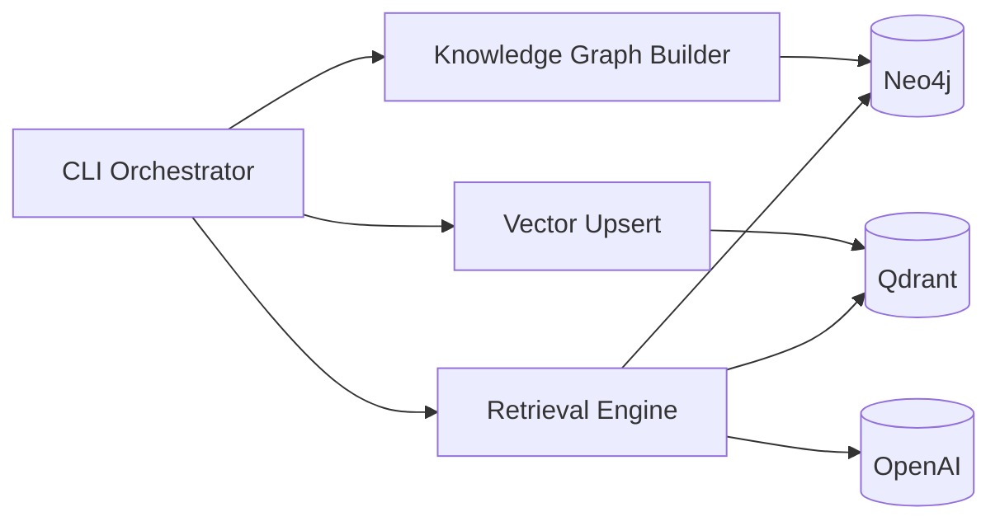
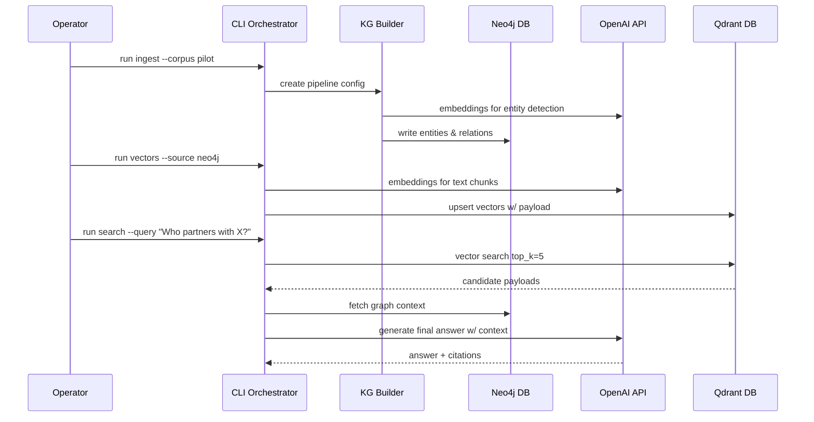

# Neo4j GraphRAG Architecture Document

## Introduction
This document outlines the overall project architecture for Neo4j GraphRAG, including backend systems, shared services, and non-UI specific concerns. Its primary goal is to serve as the guiding architectural blueprint for AI-driven development, ensuring consistency and adherence to chosen patterns and technologies.

**Relationship to Frontend Architecture:** The initial release is CLI-only; no separate frontend architecture document is required. If a UI emerges, it must adopt the technology choices recorded here.

### Starter Template or Existing Project
Greenfield implementation. No starter template or legacy codebase is being reused; everything is composed from official Python packages and existing managed Neo4j/Qdrant services.

### Change Log
| Date       | Version | Description                                             | Author     |
|------------|---------|---------------------------------------------------------|------------|
| 2025-09-24 | 0.1     | Recast architecture document into BMAD structure; added diagrams, tech stack, workflows | Codex CLI  |

## High Level Architecture
### Technical Summary
The solution is a Python 3.12 CLI that orchestrates knowledge-graph ingestion and retrieval using the official `neo4j-graphrag` package. It connects to managed Neo4j (graph storage), Qdrant (vector database), and OpenAI services (generation + embeddings). Primary patterns include a modular pipeline for ingestion, idempotent vector sync, and a retrieval layer that joins vector hits with graph context.

### High Level Overview
- Architectural style: Monolithic CLI orchestrator with external managed services.
- Repository structure: Single repository containing CLI code, IaC descriptors, and documentation.
- Services: Neo4j database `graphrag`, Qdrant collection `grag_main_v1`, OpenAI APIs.
- Data Flow: Text sources → KG builder → Neo4j; embeddings → Qdrant; retrieval pipeline queries Qdrant then Neo4j before handing results to OpenAI LLM.
- Rationale: Minimal infra footprint, leverages managed services, satisfies isolation and latency targets from PRD.

### High Level Project Diagram
```mermaid
graph TD
    Operator[Operator CLI]
    Venv[Python CLI (venv)]
    GraphRAG[Neo4j GraphRAG Library]
    Neo4j[(Neo4j DB\ngraphrag)]
    Qdrant[(Qdrant Collection\ngrag_main_v1)]
    OpenAI[(OpenAI APIs)]

    Operator --> Venv --> GraphRAG
    GraphRAG --> Neo4j
    GraphRAG --> Qdrant
    GraphRAG --> OpenAI
    Qdrant <-->|Vector IDs| Neo4j
```

### Architectural and Design Patterns
- **Monolithic CLI Orchestrator:** A single Python executable coordinates ingestion, retrieval, and ops. _Rationale:_ Simplifies deployment for a CLI-only workflow; avoids premature service decomposition.
- **Repository + Dependency Injection Patterns:** Components accept drivers/clients (Neo4j, Qdrant, OpenAI) as constructor params. _Rationale:_ Enables testing with fakes and future swapping of providers.
- **Vector-Graph Join Pattern:** Store Neo4j identifiers in Qdrant payload and rehydrate graph context after vector retrieval. _Rationale:_ Preserves grounded responses and supports auditing.

## Tech Stack
### Cloud Infrastructure
- **Provider:** Self-managed infrastructure (Neo4j Aura or on-prem), Qdrant managed cluster, OpenAI SaaS.
- **Key Services:** Neo4j DBMS 5.x, Qdrant vector DB 1.10+, OpenAI GPT/Embedding APIs.
- **Deployment Regions:** Match existing data residency requirements (default: us-west).

### Technology Stack Table
| Category            | Technology                       | Version      | Purpose                                        | Rationale                                                     |
|---------------------|----------------------------------|--------------|------------------------------------------------|---------------------------------------------------------------|
| Language            | Python                           | 3.12         | Primary implementation language                | Modern LTS, compatible with neo4j-graphrag dependencies       |
| Runtime             | CPython                          | 3.12         | Execution environment                          | Stable, supported by packaging tools                          |
| Package             | neo4j-graphrag                   | latest 0.9.x | Knowledge graph ingestion & retrieval utilities | First-party integration for Neo4j + Qdrant                    |
| Package             | neo4j                            | 5.x driver   | Bolt connectivity to Neo4j                     | Official driver with async support                            |
| Package             | qdrant-client                    | 1.10+        | Vector DB client                               | Native client for Qdrant with async + payload helpers         |
| Package             | openai                           | 1.x          | LLM and embedding access                        | Supports GPT-4o-mini and text-embedding-3-small               |
| Observability       | structlog / logging              | 24.x         | Structured logging                              | Lightweight, JSON-friendly output for ops telemetry           |
| Testing             | pytest                           | 8.x          | Unit/integration testing                        | Broad plugin ecosystem, simple CLI workflows                  |
| Packaging           | pip-tools (optional)             | 7.x          | Dependency locking                              | Deterministic builds for production environments              |
| Infrastructure IaC  | Terraform (optional)             | 1.8          | Manage Neo4j/Qdrant credentials + secrets       | Align with existing ops automation                            |

## Data Models
### Entity
**Purpose:** Represents a unique object extracted from the corpus (concept, person, org, etc.) stored in Neo4j.

**Key Attributes:**
- `id`: string — Stable identifier used for joins.
- `title`: string — Human-readable name.
- `type`: string — Entity classification (Person, Concept, etc.).
- `properties`: map — Arbitrary metadata from KG pipeline.

**Relationships:**
- Connected to other entities via `RELATES_TO` edges with weights.

### RelationshipEdge
**Purpose:** Captures directional relationships between entities in Neo4j.

**Key Attributes:**
- `weight`: float — Confidence/importance.
- `source`: string — Provenance of relationship.

**Relationships:**
- `(:Entity)-[:RELATES_TO]->(:Entity)` pairs within Neo4j database.

### VectorRecord
**Purpose:** Represents an embedded text chunk stored in Qdrant.

**Key Attributes:**
- `vector`: float[1536] — Embedding values.
- `neo4j_id`: string — Join key to Neo4j entity.
- `doc_id`: string — Source document identifier.
- `chunk`: string — Text snippet for context regeneration.
- `source`: string — Provenance metadata.

**Relationships:**
- Links indirectly to Neo4j entities through `neo4j_id` payload.

## Components
### CLI Orchestrator
**Responsibility:** Entry point for ingestion, vector sync, retrieval validation, and ops commands.

**Key Interfaces:**
- CLI options/commands (`ingest`, `upsert`, `search`).
- `.env` configuration loader.

**Dependencies:** Neo4j driver, Qdrant client, OpenAI SDK, configuration modules.

**Technology Stack:** Python CLI (click or argparse), structlog for telemetry.

### Knowledge Graph Builder
**Responsibility:** Transform corpus into entities/relations using `SimpleKGPipeline` utilities.

**Key Interfaces:**
- Pipeline configuration YAML/JSON.
- Neo4j session write handles.

**Dependencies:** neo4j-graphrag KG modules, Neo4j driver, local file system.

**Technology Stack:** `neo4j_graphrag.pipeline`, optional async execution.

### Vector Upsert Service
**Responsibility:** Embed text units and upsert vectors to Qdrant with payload join keys.

**Key Interfaces:**
- OpenAI embedding API.
- Qdrant batch upsert API.

**Dependencies:** qdrant-client, openai, retry/backoff utilities.

**Technology Stack:** Python async tasks or synchronous batches with concurrency guards.

### Retrieval Engine
**Responsibility:** Execute hybrid retrieval and produce grounded answers.

**Key Interfaces:**
- `QdrantNeo4jRetriever.search()`
- `GraphRAG` generation pipeline.

**Dependencies:** Neo4j driver, Qdrant client, OpenAI LLM wrapper.

**Technology Stack:** `neo4j_graphrag.retrievers`, `neo4j_graphrag.generation`.

### Component Diagram


## External APIs
### OpenAI API
- **Purpose:** Text generation (`gpt-4.1-mini` baseline, fallback `gpt-4o-mini`) and embeddings (`text-embedding-3-small`).
- **Documentation:** https://platform.openai.com/docs
- **Base URL(s):** `https://api.openai.com/v1`
- **Authentication:** Bearer token via `OPENAI_API_KEY`.
- **Rate Limits:** Subject to account tier; monitor tokens/minute.

**Key Endpoints Used:**
- `POST /v1/chat/completions` — Generate answers with grounded context.
- `POST /v1/embeddings` — Produce 1536-d embeddings for text chunks.

**Integration Notes:** Implement exponential backoff, respect usage caps, and redact sensitive data before sending to OpenAI.

## Core Workflows


## Database Schema
- **Neo4j:** Nodes labeled `Entity` with unique `id`; relationships `RELATES_TO` optionally contain `weight`, `source`, `confidence`. Index `Entity(id)` and constraints for uniqueness.
- **Qdrant:** Collection `grag_main_v1` sized to 1536 with cosine distance. Payload schema includes `neo4j_id` (string), `doc_id` (string), `chunk` (text), `source` (string). Use payload-based filtering for dataset slices.

## Source Tree
```text
neo4j-graphrag/
├── docs/
│   ├── architecture.md
│   ├── prd.md
│   └── ...
├── src/
│   ├── cli/
│   │   ├── __init__.py
│   │   ├── ingest.py
│   │   ├── vectors.py
│   │   └── search.py
│   ├── pipelines/
│   │   ├── kg_builder.py
│   │   └── vector_upsert.py
│   └── config/
│       ├── settings.py
│       └── logging.py
├── scripts/
│   ├── bootstrap.sh
│   └── backup-qdrant.sh
├── tests/
│   ├── unit/
│   └── integration/
└── pyproject.toml
```

## Infrastructure and Deployment
- **Infrastructure as Code:** Terraform 1.8 (optional) stored under `infra/terraform`; defines secrets, network rules, and scheduled jobs.
- **Deployment Strategy:** CLI distributed via git tags; operators set up virtual envs manually. CI/CD workflows (GitHub Actions) lint, test, and build release artifacts.
- **Environments:**
  - **dev:** Local sandbox Neo4j/Qdrant instances for iteration.
  - **staging:** Managed services with anonymized data to validate pipelines.
  - **prod:** Live managed services with full data; restricted access.
- **Environment Promotion Flow:**
```
dev → staging → prod
```
- **Rollback Strategy:** Re-run previous release scripts with known dependency lockfiles; restore Neo4j/Qdrant from latest snapshot (RTO ≤ 2 hours).

## Error Handling Strategy
- **General Approach:** Explicit exception hierarchy wrapping external client errors; propagate structured errors back to CLI with actionable messages.
- **Logging Standards:** structlog 24.x emitting JSON lines with correlation IDs, operation name, duration, and status fields.
- **External API Errors:** Exponential backoff (max 5 retries) for OpenAI/Qdrant transient errors; circuit breaker to prevent runaway cost.
- **Business Logic Errors:** Custom exceptions (`IngestionError`, `VectorSyncError`, `RetrievalError`) mapped to exit codes; user-facing messaging includes remediation hints.
- **Data Consistency:** Neo4j writes wrapped in transactions; Qdrant upserts tracked via idempotency keys; compensation step deletes partial batches on failure.

## Coding Standards
- **Languages & Runtimes:** Python 3.12; enforce `ruff` + `black` formatting (line length 100).
- **Style & Linting:** Ruff configuration stored in `pyproject.toml`; type checking with `mypy` focused on critical modules.
- **Test Organization:** Mirror `src` module layout (`tests/unit/cli/test_ingest.py`, etc.).
- **Critical Rules:**
  - **Secrets Handling:** Never log raw API keys or passwords; redact before logging.
  - **Driver Lifecycle:** Use context managers for Neo4j sessions and close Qdrant clients gracefully.
  - **Retry Limits:** Cap OpenAI retries to protect against cost overruns; log token usage per request.
