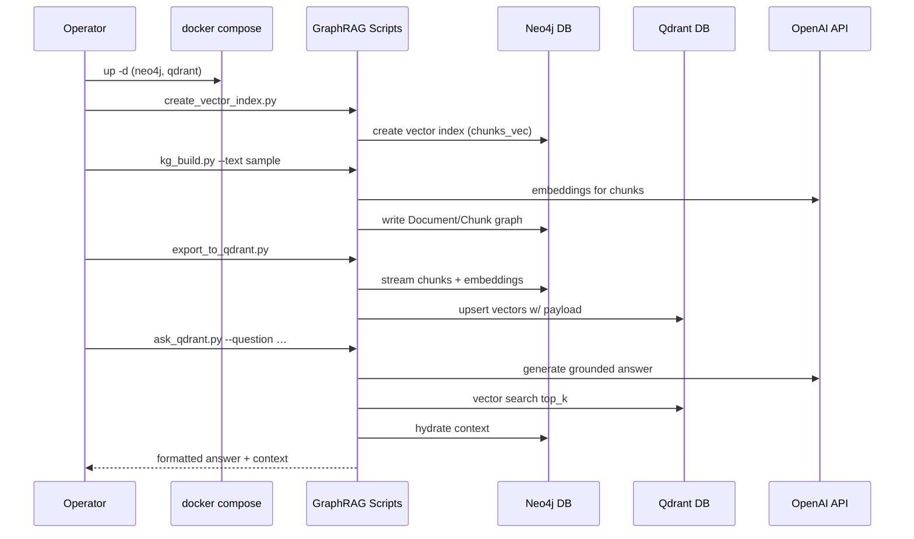

# Neo4j GraphRAG Architecture Document

## Introduction
This document outlines the overall project architecture for Neo4j GraphRAG, including backend systems, shared services, and non-UI specific concerns. Its primary goal is to guide AI-assisted development and ensure consistency with the product definition.

**Relationship to Frontend Architecture:** The initial release is CLI-only; no separate frontend architecture document is required. If a UI emerges, it must adopt the technology choices recorded here.

### Starter Template or Existing Project
Greenfield implementation grounded in the official `neo4j-graphrag` Python package. Version 1 operates entirely on a local Docker Compose stack (Neo4j + Qdrant) so teams can validate the workflow without managed services. Connection variables allow promotion to hosted deployments later.

### Change Log
| Date       | Version | Description                                                                   | Author     |
|------------|---------|-------------------------------------------------------------------------------|------------|
| 2025-09-24 | 0.1     | Recast architecture document into BMAD structure; added diagrams and workflows | Codex CLI  |
| 2025-09-28 | 0.2     | Shifted scope to local Docker stack and scripted minimal path                 | Codex CLI  |
| 2025-10-02 | 0.3     | Documented upcoming `kg_build.py` modular refactor and linked addendum        | Codex CLI  |
| 2025-10-06 | 0.4     | Reflected delivered FancyRAG modules, telemetry/automation scope, and managed-endpoint readiness | Codex CLI  |

## High Level Architecture
### Technical Summary
The solution is a Python 3.12 CLI that orchestrates knowledge-graph ingestion and retrieval using the official `neo4j-graphrag` package. Docker Compose (`docker-compose.neo4j-qdrant.yml`) launches Neo4j 5.26.12 with APOC Core and Qdrant 1.15.4 on the developer host. FancyRAG modules under `src/fancyrag/` wrap `SimpleKGPipeline`, Neo4j/Qdrant helpers, caching splitters, and QA evaluators. Python scripts (`scripts/*.py`) expose operable commands that create the Neo4j vector index, run ingestion, export embeddings to Qdrant, and execute retrieval with `QdrantNeo4jRetriever` and OpenAI GPT models.

### High Level Overview
- **Architectural style:** Monolithic CLI orchestrator with modular FancyRAG subsystems and local containerized dependencies.
- **Repository structure:** Single repository containing CLI code, scripts, Compose files, and documentation.
- **Services:** Neo4j database (default DB `neo4j`), Qdrant collection (`chunks_main`), OpenAI APIs.
- **Data Flow:** Text/PDF sources → KG builder → Neo4j (Document/Chunk nodes) → export embeddings → Qdrant → retrieval joins vector hits with Neo4j context → OpenAI generates grounded answers.
- **Rationale:** Enables reproducible experimentation on a laptop, keeps compatibility with production endpoints via configuration, and exercises first-party GraphRAG APIs end-to-end.

### High Level Project Diagram
```mermaid
graph TD
    Operator[Operator CLI]
    Compose[Docker Compose]
    CLI[Python CLI (venv)]
    KGB[GraphRAG Scripts]
    Neo4j[(Neo4j 5.26.12)]
    Qdrant[(Qdrant)]
    OpenAI[(OpenAI APIs)]

    Operator --> Compose
    Operator --> CLI --> KGB
    Compose --> Neo4j
    Compose --> Qdrant
    KGB --> Neo4j
    KGB --> Qdrant
    KGB --> OpenAI
    Qdrant <-->|neo4j_id| Neo4j
```

### Architectural and Design Patterns
- **Monolithic CLI Orchestrator:** A single Python entrypoint plus helper scripts coordinate ingestion, vector sync, and retrieval.
- **Dependency Injection:** Scripts accept drivers/clients (Neo4j, Qdrant, OpenAI) via configuration helpers for easy swapping.
- **Structured Telemetry Artifacts:** Ingestion emits sanitized JSON/Markdown bundles (run logs, QA reports, upcoming manifest schema) to `artifacts/local_stack/` for downstream QA and PM automation.
- **Vector-Graph Join Pattern:** Store Neo4j identifiers in Qdrant payloads and hydrate graph context post-search to preserve grounded responses.
- **Idempotent Pipelines:** Each script is safe to rerun; Neo4j writes use `MERGE` and Qdrant upserts replace existing vectors.

## Delivered FancyRAG Modules
- Status: Stories 4.3–4.6 migrated the ingestion pipeline into `src/fancyrag/` with dedicated packages for splitters, QA evaluation/reporting, Neo4j Cypher helpers, schema loading, and CLI orchestration. `scripts/kg_build.py` now delegates to `fancyrag.cli.kg_build_main.main`.
- Guardrails: Modules remain within 200–400 LOC, fully typed, and covered by unit test suites (`tests/unit/fancyrag/...`). Integration smoke (`tests/integration/local_stack/test_minimal_path_smoke.py`) ensures parity with the original monolith.
- Documentation: Source tree shards, refactor addendum, and Epic 4 entries have been updated to reflect the delivered modules.

## Upcoming Service Hardening (Epic 5: FancyRAG Service Hardening)
- Objective: Address maintainability gaps highlighted in the Oct 2025 refactor report—decomposing the ingestion pipeline, centralising configuration, adding pluggable adapters, caching expensive operations, introducing automated RAG evaluation, and instrumenting observability.
- Key Deliverables:
  - Composable pipeline helpers for settings, source discovery, client construction, ingestion, semantic enrichment, and QA.
  - Typed settings surface (`FancyRAGSettings`) replacing ad-hoc environment lookups across CLI and pipeline entry points.
  - Adapter interfaces (`Embedder`, `VectorStore`, `KGWriter`, `LLM`, etc.) with GraphRAG/OpenAI implementations to enable future swapping and easier testing.
  - Embedding and generation caching with configurable TTL/versioning and telemetry on hit ratios.
  - RAG evaluation harness (e.g., RAGAS) producing scorecards and CI gating on retrieval/faithfulness metrics.
  - OpenTelemetry-based tracing and metrics covering every ingestion stage with OTLP export support.
- Planning Artifacts: See `docs/prd.md` (v0.4), `docs/brownfield-architecture.md`, and the maintainability roadmap (`docs/Refactoring for maintainability.pdf`).

## Tech Stack
See `docs/architecture/tech-stack.md` for the authoritative table. Highlights:
- Python 3.12 with `neo4j-graphrag[experimental,openai,qdrant]`.
- Neo4j 5.26.12 (Docker) with APOC Core.
- Qdrant 1.15.4 (Docker) accessed via `qdrant-client` ≥ 1.8.
- OpenAI GPT-4.1 models (`gpt-4.1-mini`, fallback `gpt-4o-mini`) and `text-embedding-3-small`.
- Structured logging through `structlog` or JSON `logging` handlers.

## Environments
- **Local (default):** Docker Compose stack listening on localhost (`7474`, `7687`, `6333`). Data persisted under `./.data/{neo4j,qdrant}`.
- **Managed (future):** Override `.env` to point at hosted Neo4j/Qdrant once the workflow is productionized.

Promotion path: `local → managed sandbox → managed prod` (future work).

## Core Workflows


## Database & Collection Schema
- **Neo4j:**
  - Nodes: `Document{id, title, source}`, `Chunk{id, text, embedding, doc_id}`.
  - Relationships: `Document`-`HAS_CHUNK`→`Chunk`; entity/relationship nodes created by `SimpleKGPipeline`.
  - Index: Vector index `chunks_vec` on `Chunk(embedding)` (dimensions default 1536, cosine similarity).
- **Qdrant:**
  - Collection: `chunks_main` (vectors size 1536, cosine distance).
  - Payload: `{neo4j_id: string, doc_id: string, chunk: string, source: string}`.
  - Filters: allow doc-based filtering for targeted questions.

## Source Tree
See `docs/architecture/source-tree.md` for the up-to-date tree including Compose and script artifacts.

## Infrastructure and Deployment
- **Infrastructure as Code:** Docker Compose defines local services; Terraform references retained for future managed environments but out of scope for v1.
- **Deployment Strategy:** CLI distributed via git tags; operators clone repository, run `scripts/bootstrap.sh`, and bring up Compose stack locally.
- **Rollback Strategy:** Shut down Compose (`docker compose down --volumes`) to reset data. For managed deployments, plan to restore from snapshots (future work).

## Error Handling
- **General Approach:** Wrap external client errors (`neo4j`, `qdrant_client`, `openai`) with custom exceptions and exit codes; log remediation hints.
- **Retries:** Exponential backoff (max 5) for OpenAI 429/503; retry Neo4j/Qdrant network errors with jittered delays.
- **Observability:** Structured logs include `operation`, `duration_ms`, `status`, `index_name`/`collection`, and counts of processed chunks.

## Coding Standards
Refer to `docs/architecture/coding-standards.md` for detailed guidance. Key highlights for this architecture:
- Scripts must honour `.env` and CLI overrides.
- Ensure idempotent writes to Neo4j/Qdrant.
- Provide integration smoke tests that run against the Compose stack before release.

## Security Considerations
- Secrets loaded from `.env`; never commit real keys.
- Compose stack is bound to localhost only; use Docker profiles or firewalls to restrict exposure.
- Optional API keys (Qdrant) stored locally for parity with hosted environments.

## Next Steps
- Implement the scripted workflow described above.
- Extend diagnostics to validate Compose service health (bolt + HTTP probes).
- Plan migration path for pointing scripts at managed services once v1 succeeds.
