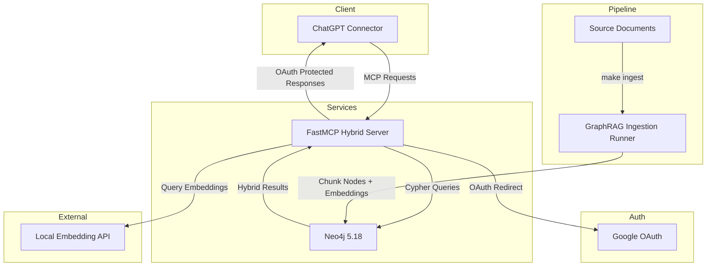

# Fancryrag Hybrid NeoRAG Upgrade Architecture Document

## Introduction
This document outlines the overall system architecture for Fancryrag Hybrid NeoRAG Upgrade, covering backend services, shared infrastructure, and cross-cutting concerns. It serves as the architectural blueprint guiding AI-driven development, ensuring alignment with the Product Requirements Document (PRD) and consistent implementation practices.

### Starter Template or Existing Project
Existing NeoRAG baseline repository using Python 3.12 with Astral `uv`, Neo4j 5.18, and GraphRAG ingestion pipeline. No external starter template required; we extend the current codebase.

### Change Log
| Date       | Version | Description                                   | Author  |
|------------|---------|-----------------------------------------------|---------|
| 2025-10-08 | 0.1     | Initial architecture draft for hybrid upgrade | Winston |

## High Level Architecture

### Technical Summary
The system is a containerized backend platform centered on Neo4j graph storage with both vector and full-text indexes, ingesting documents via a Python GraphRAG pipeline and exposing retrieval through a FastMCP server secured with Google OAuth. Key components include the ingestion pipeline, Neo4j database with dual indexes, a HybridCypherRetriever-based MCP service, and integration with an external OpenAI-compatible embedding service. This architecture supports PRD goals by enabling hybrid semantic + lexical search, maintaining existing ingestion workflows, and providing secure MCP access for ChatGPT connectors.

### High Level Overview
1. **Architecture Style**: Modular monolith of containerized services (Neo4j + MCP server) orchestrated via Docker Compose on a shared bridge network.  
2. **Repository Structure**: Single repo housing Python sources (`tools/`, `servers/`, `scripts/`), configuration, and infrastructure-as-code.  
3. **Service Layout**: Core services are the Neo4j database and the MCP hybrid retriever; supporting services include an external embedding API and ChatGPT connector clients.  
4. **Primary Flow**: Text documents ingest through the GraphRAG pipeline, creating `Chunk` nodes and embeddings in Neo4j. Retrieval requests from ChatGPT hit the MCP server, which authenticates via Google OAuth, embeds the query using the external API, and executes a hybrid Cypher search combining vector and full-text scores.  
5. **Key Decisions**:  
   - Retain Python stack with GraphRAG helpers for index creation.  
   - Use FastMCP for rapid MCP server scaffolding with OAuth support.  
   - Run services locally via Docker Compose for parity with production deployments.  
   - Keep configuration environment-driven via `.env.local`/`.env.example`.

### High Level Project Diagram

## Domain & Data Architecture
- **Domain Overview**: Processes unstructured documents into graph-based knowledge (Chunk nodes, relationships) to support retrieval augmented generation.  
- **Aggregate Roots**:  
  - `Chunk`: stores text, embedding vector, metadata.  
  - Relationship entities (e.g., `(:Entity)-[:MENTIONS]->(:Chunk)`) created by GraphRAG resolvers.  
- **Key Properties**:  
  - `Chunk.text`: raw text content.  
  - `Chunk.embedding`: 768-d vector representing semantics.  
  - Index metadata (vector index `text_embeddings`, full-text index `chunk_text_fulltext`).  
- **Data Sources**: Operator-supplied documents, local embedding service for embeddings, OpenAI LLM for extraction.  
- **Data Flow**: Ingestion pipeline splits text → embeds chunks → extracts entities/relations → writes to Neo4j → index scripts ensure vector + full-text indexes. Hybrid retriever reads data combining vector and full-text scoring.

## Application Architecture

### Components
1. **GraphRAG Ingestion Runner (`tools/run_pipeline.py`)**  
   - Loads `.env.local`, executes `pipelines/kg_ingest.yaml`.  
   - Depends on `neo4j_graphrag.experimental` components (splitter, embedder, extractor, writer).  
   - Writes nodes/edges to Neo4j using configured credentials.

2. **Neo4j Graph Database**  
   - Hosted via `neo4j:5.18` container with APOC plugin.  
   - Maintains vector index (`text_embeddings`) and full-text index (`chunk_text_fulltext`).  
   - Stores ingestion results and supports hybrid search queries.

3. **Index Management Scripts**  
   - Existing Makefile `index` target for vector index.  
   - New `scripts/create_fulltext_index.py` executed via `make fulltext-index` to ensure lexical support (per PRD FR1/FR2).  
   - All scripts idempotent to permit re-runs.

4. **FastMCP Hybrid Server (`servers/mcp_hybrid_google.py`)**  
   - Instantiates Neo4j driver and `HybridCypherRetriever`.  
   - Defines MCP tools `search` (hybrid query) and `fetch` (node lookup).  
   - Uses environment variables for DB connectivity, index names, query template, embedding API, and OAuth credentials.  
   - Runs with `stateless_http` transport on port 8080.

5. **OAuth Layer**  
   - `fastmcp.server.auth.providers.google.GoogleProvider` protecting endpoints.  
   - Requires `BASE_URL`, `GOOGLE_OAUTH_CLIENT_ID`, `GOOGLE_OAUTH_CLIENT_SECRET`.  
   - Publishes discovery metadata for ChatGPT dynamic client registration.

6. **ChatGPT Connector**  
   - External consumer authenticating via Google OAuth.  
   - Issues MCP `search`/`fetch` calls once authorized.  
   - Provides necessary bearer tokens in Authorization header.

7. **External Embedding API**  
   - OpenAI-compatible endpoint (e.g., `http://localhost:20010/v1`).  
  - Supplies embeddings for ingestion and query-time retrieval.  
  - Access controlled via `EMBEDDING_API_KEY` if required.

### API & Integration Contracts
- **MCP Tools**:  
  - `POST /mcp/search`: `{ "query": str, "top_k": int }` → list of `{ text, score, metadata }`.  
  - `POST /mcp/fetch`: `{ "node_id": int }` → `{ found, text, labels }`.  
- **Neo4j Queries**: Hybrid query template returns `text`, metadata, vector (`score_vector`) and full-text (`score_fulltext`) scores.  
- **OAuth Endpoints**: `.well-known/oauth-protected-resource`, `/auth/callback` per FastMCP defaults.

### Configuration & Environment
- `.env.example` extended with `INDEX_NAME`, `FULLTEXT_INDEX_NAME`, embedding and OAuth variables.  
- `.env.local` consumed by ingestion runner and MCP container via `env_file`.  
- Default ports: Neo4j bolt `7687`, HTTP console `7474`, MCP `8080`.

## Infrastructure Architecture

### Runtime Environments
- **Local / Dev**: `uv sync`, `docker compose up -d neo4j mcp`, indexes via Makefile, local embedding API or remote service.  
- **Staging/Prod**: Same containers deployed on managed hosts (e.g., ECS, GKE, bare-metal) behind HTTPS load balancer pointing to FastMCP `BASE_URL`.

### Networking
- All services share `rag-net` Docker bridge network.  
- MCP server accesses Neo4j via `bolt://neo4j:7687`.  
- External embedding and OAuth endpoints accessed over HTTPS.  
- Production requires TLS termination at ingress to enforce HTTPS.

### Deployment Pipeline
**Local workflow**
1. Install dependencies with `uv sync`.  
2. Run `make index` and `make fulltext-index` once per environment.  
3. Execute `make ingest f=<file>` to load sample data.  
4. Launch Neo4j and MCP locally via `docker compose up -d neo4j mcp`.

**CI/CD workflow (GitHub Actions example)**
1. Trigger on pull requests to `main` and pushes to release branches.  
2. Jobs: (a) lint (`ruff check` / `ruff format --check`), (b) unit tests (`pytest`), (c) integration smoke (spin up Neo4j via Testcontainers, seed fixture, invoke hybrid search).  
3. On successful main build, publish MCP image to container registry (`ghcr.io/drjlabs/neorag-mcp`).  
4. Deploy staging via IaC (Terraform/CDK) pointing to the new image; run post-deploy script to call `/mcp/health` and sample `search`.  
5. Require manual approval before promoting to production. Production deploy executes the same IaC module with prod variables, followed by `docker compose` or orchestration rollout.  
6. Record deployment artifacts (image digest, commit SHA) in release notes.

### Observability
- **Logging**: All services log to stdout in JSON/object form. MCP server should adopt structured logging (e.g., `structlog` or Python `logging` JSON formatter). Neo4j logs stored under mounted volumes. Forward both streams to centralized log storage (e.g., CloudWatch Logs) for staging/production.  
- **Metrics**: Capture Neo4j metrics (`dbms/queryLatency`, `db/index/sampledNodes`) via Prometheus or Aura dashboards, and expose FastMCP HTTP metrics (latency, auth failures) using an OpenTelemetry exporter.  
- **Alerting**: Configure alerts for Neo4j query latency > 1s, MCP 5xx rate > 2% over 5 minutes, and OAuth handshake failures > 5/min.  
- **Tracing**: Optional; integrate FastMCP with OpenTelemetry to trace query execution when diagnosing latency spikes.

## Non-Functional Architecture
- **Scalability**: Neo4j vertical scaling (memory/cpu). MCP server stateless and horizontally scalable behind load balancer.  
- **Performance Targets**: Search latency ≤ 1.5s for `top_k=5`; ingestion throughput dependent on embedding API.  
- **Reliability**: Docker Compose ensures restart-on-failure; production should use managed orchestrator (ECS/Kubernetes) with health checks.  
- **Maintainability**: Python code structured in `tools/`, `scripts/`, `servers/`; documentation in `docs/`.  
- **Cost Considerations**: Favor local embedding service to avoid external API costs; use single Neo4j instance initially.

## Security Architecture
- **Input Validation**:  
  - Use `pydantic` or lightweight schema validation inside MCP server endpoints for request bodies.  
  - Sanitize/validate query strings before executing Cypher (Hybrid retriever handles parameterization).  
- **Authentication & Authorization**:  
  - Google OAuth (OpenID Connect) via FastMCP; tokens validated per provider.  
  - Bearer tokens required for all MCP calls; unauthorized requests return 401/403.  
- **Secrets Management**:  
  - Development: `.env.local` (excluded from VCS).  
  - Production: inject via secret store (AWS Secrets Manager, GCP Secret Manager, etc.). Never log credentials.  
  - **Ownership & Rotation**: Platform engineering provisions Google OAuth client credentials and embedding API keys; Product Owner confirms scopes. Secrets are stored in the secret manager and rotated quarterly. During rotation, deploy MCP with new secrets while keeping the old secret active until verification succeeds, then revoke the previous secret. Document the workflow in operations runbook.  
- **API Security**:  
  - Rate limit MCP endpoints at reverse proxy (e.g., Cloudflare/NGINX) to mitigate abuse.  
  - Enforce strict CORS allowing only trusted origins if exposing browser clients.  
  - Ensure HTTPS via managed TLS; redirect HTTP→HTTPS.  
- **Data Protection**:  
  - Neo4j volumes encrypted (filesystem or managed storage).  
  - All network traffic uses TLS (embedding API, OAuth).  
  - Avoid logging raw document text in application logs.  
- **Dependency Security**:  
  - Use `uv pip list --outdated` or `pip-audit` in CI.  
  - Review/approve new dependencies via PR checks.  
- **Security Testing**:  
  - Static analysis (e.g., `bandit`) on Python code.  
  - Periodic DAST using OWASP ZAP against MCP endpoints.  
  - Annual penetration tests when exposed publicly.

## Testing Strategy
- **Unit Tests**:  
  - Focus on ingestion helpers, MCP utility functions, and configuration loaders. Use `pytest` with dependency injection/mocking.  
- **Integration Tests**:  
  - Spin up ephemeral Neo4j (Testcontainers) and run hybrid retrieval queries with seeded data.  
  - Validate OAuth flow using mocked Google endpoints in local tests.  
- **End-to-End Tests**:  
  - Use smoke scripts to ingest data, execute `make fulltext-index`, then call MCP search verifying lexical + semantic results. Include regression suite in CI (nightly) that runs against staging Neo4j to catch index drift.  
- **Continuous Testing**:  
  - Integrate tests into CI pipeline triggered on PRs; add nightly job to run ingestion + retrieval regression suite.  
- **Test Data Management**:  
  - Store fixtures under `tests/fixtures`. Use synthetic corpora with known keywords for deterministic assertions.

## Operational Runbook (Summary)
1. Provision `.env.local` with Neo4j, index names, embedding API, and Google OAuth credentials.  
2. `uv sync` then `docker compose up -d neo4j mcp`.  
3. Run `make index` and `make fulltext-index`.  
4. Ingest content via `make ingest f=<file>`.  
5. Confirm OAuth metadata and MCP search endpoints.  
6. Monitor logs for errors; re-run index scripts as needed after schema changes.

## Risks & Mitigations
- **Index Drift**: Documented re-run process for index scripts; consider scheduled jobs.  
- **OAuth Misconfiguration**: Add startup assertions verifying required env vars; provide troubleshooting guide.  
- **Embedding Service Latency**: Implement retries and timeouts; allow configurable fallback provider.  
- **Neo4j Scaling Limitations**: Plan for read replicas or Aura upgrade if dataset grows beyond single instance capacity.

## Next Steps
- Review architecture with Product Owner and DevOps to confirm environment alignment.  
- Story 1.1 (index automation) completed 2025-10-09; apply this architecture to Story 1.2 implementation planning.  
- Prepare staging environment with HTTPS and OAuth credentials to validate hybrid retrieval ahead of production rollout.
