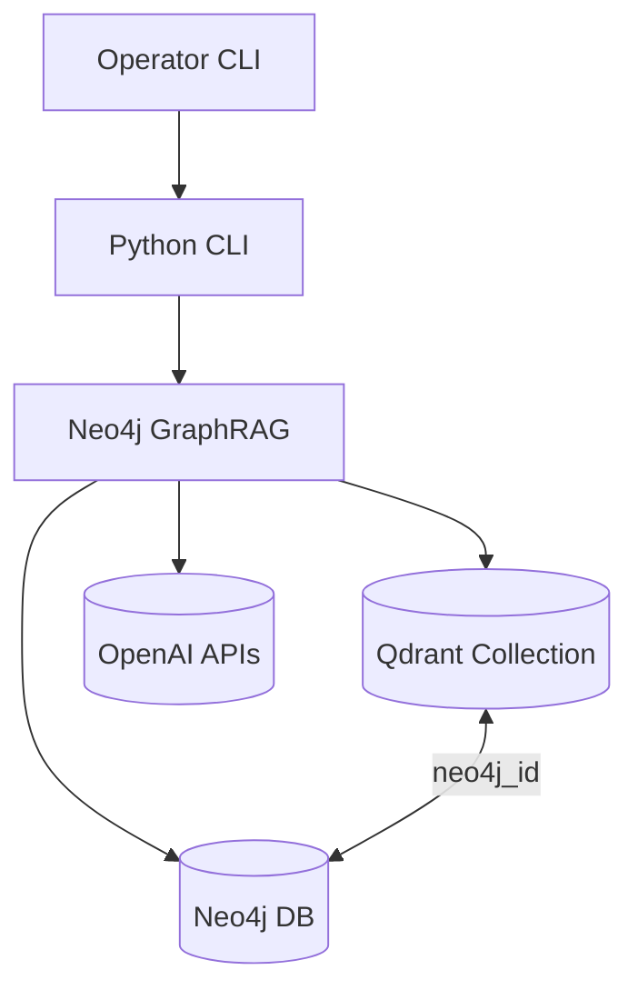

# Architecture Overview

## Technical Summary
The Neo4j GraphRAG solution is a Python 3.12 CLI that orchestrates knowledge graph ingestion, vector synchronization, and retrieval with the official `neo4j-graphrag` library. It integrates with managed Neo4j for graph storage, Qdrant for vectors, and OpenAI for generation and embeddings. Core patterns include a modular ingestion pipeline, idempotent vector writes, and a retrieval flow that enriches vector hits with graph context.

## High-Level Components
- CLI orchestrator that houses subcommands for ingest, vectors, and search operations.
- Knowledge Graph Builder leveraging `SimpleKGPipeline` to populate Neo4j.
- Vector upsert service handling embedding, batching, and Qdrant payload consistency.
- Retrieval engine that joins Qdrant hits with Neo4j entities and delegates answer generation to OpenAI models.
- Workspace bootstrap script (`scripts/bootstrap.sh`) that provisions the Python 3.12 virtual environment, installs pinned dependencies, and validates `neo4j_graphrag` imports before operators run CLI workflows. Run it from the repository root (`bash scripts/bootstrap.sh`) and activate the resulting virtualenv (`source .venv/bin/activate`) prior to completing the `.env` configuration story.

## Diagram

## Change Log
| Date       | Version | Description                               | Author    |
|------------|---------|-------------------------------------------|-----------|
| 2025-09-24 | 0.1     | Seeded architecture overview shard        | Codex CLI |
| 2025-09-25 | 0.2     | Documented environment configuration workflow | James      |

## Environment Configuration
- Copy `.env.example` to `.env` immediately after running `scripts/bootstrap.sh` and before executing CLI commands.
- Populate the placeholders with environment-specific values: `OPENAI_API_KEY`, `OPENAI_MODEL` (default `gpt-4o-mini`, optional `gpt-4.1-mini`), `OPENAI_EMBEDDING_MODEL`, `NEO4J_URI`, `NEO4J_USERNAME`, `NEO4J_PASSWORD`, `QDRANT_URL`, and `QDRANT_API_KEY`.
- Keep `.env` git-ignored; never commit real credentials or paste secrets into shared channels.
- Ensure the values align with managed service endpoints (Neo4j Bolt URI and Qdrant HTTPS URL) documented in the architecture.
