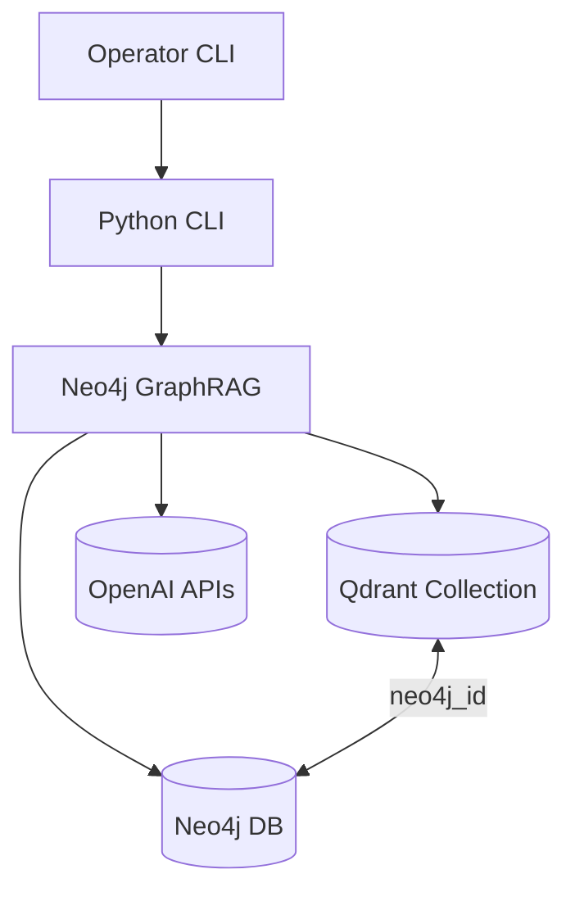

# Architecture Overview

## Technical Summary
The Neo4j GraphRAG solution is a Python 3.12 CLI that orchestrates knowledge graph ingestion, vector synchronization, and retrieval with the official `neo4j-graphrag` library. It integrates with managed Neo4j for graph storage, Qdrant for vectors, and OpenAI for generation and embeddings. Core patterns include a modular ingestion pipeline, idempotent vector writes, and a retrieval flow that enriches vector hits with graph context.

## High-Level Components
- CLI orchestrator that houses subcommands for ingest, vectors, and search operations.
- Knowledge Graph Builder leveraging `SimpleKGPipeline` to populate Neo4j.
- Vector upsert service handling embedding, batching, and Qdrant payload consistency.
- Retrieval engine that joins Qdrant hits with Neo4j entities and delegates answer generation to OpenAI models.

## Diagram

## Change Log
| Date       | Version | Description                               | Author    |
|------------|---------|-------------------------------------------|-----------|
| 2025-09-24 | 0.1     | Seeded architecture overview shard        | Codex CLI |
