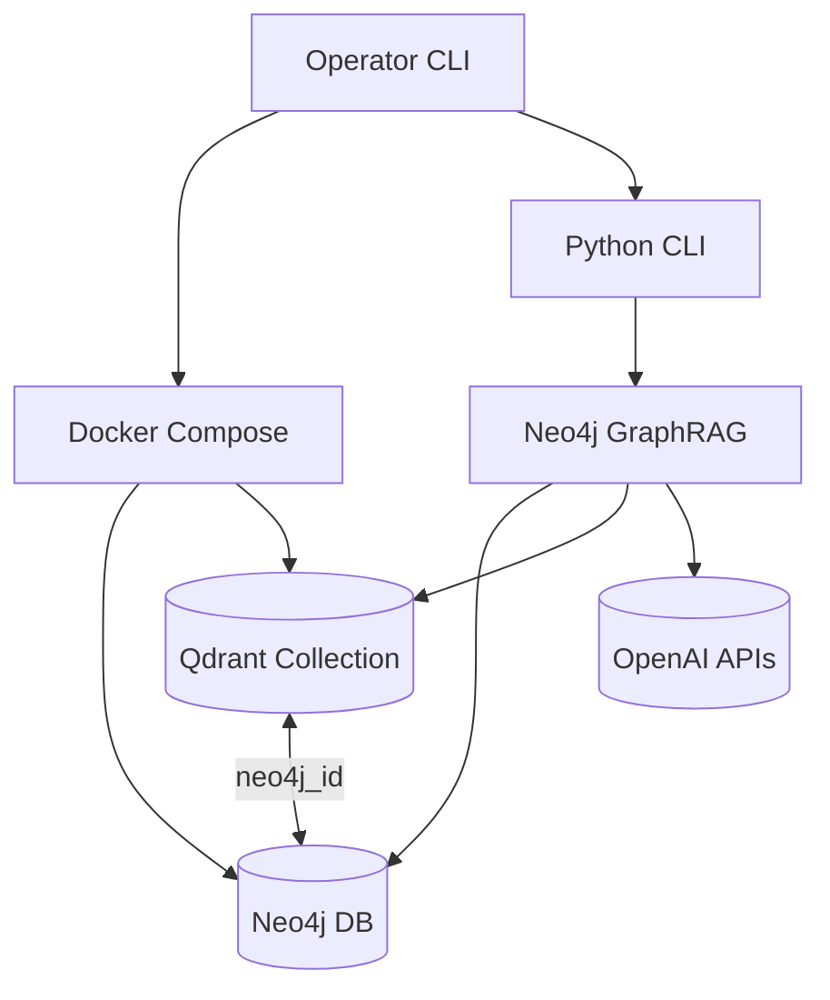

# Architecture Overview

## Technical Summary
The Neo4j GraphRAG solution runs as a Python 3.12 CLI that orchestrates knowledge graph ingestion, vector synchronization, and retrieval via the official `neo4j-graphrag` library. Version 1 anchors on a project-owned stack: Docker Compose launches Neo4j 5.26 (with APOC Core) and Qdrant latest on the developer host, while Python scripts create the Neo4j vector index, execute `SimpleKGPipeline`, export embeddings to Qdrant, and query through `GraphRAG` with `QdrantNeo4jRetriever`.

## High-Level Components
- Docker Compose stack (`docker-compose.neo4j-qdrant.yml`) that provisions Neo4j and Qdrant with persistent volumes and configurable credentials.
- CLI orchestrator housing subcommands for ingest, vectors, and search operations plus standalone scripts under `scripts/` (`create_vector_index.py`, `kg_build.py`, `export_to_qdrant.py`, `ask_qdrant.py`).
- Knowledge Graph Builder leveraging `SimpleKGPipeline` to populate Neo4j with Document and Chunk nodes and embeddings.
- Vector export service that streams embeddings from Neo4j into Qdrant with join payloads.
- Retrieval engine that joins Qdrant hits with Neo4j entities and delegates answer generation to OpenAI models.
- Workspace bootstrap script (`scripts/bootstrap.sh`) that provisions the Python 3.12 virtual environment, installs `neo4j-graphrag[experimental,openai,qdrant]`, and validates imports. Run it before executing Compose workflows and activate the virtualenv (`source .venv/bin/activate`) prior to running scripts.

## Built-In Tool Playbook
Always consult the canonical documentation set below before running any GraphRAG tooling (CLI subcommands, bootstrap scripts, or diagnostics helpers). These files are updated whenever workflows change and must be treated as the source of truth:

- `docs/architecture/overview.md` (this file) — top-level workflows, environment sequencing, and operational guardrails.
- `docs/architecture/source-tree.md` — current locations for CLI entrypoints, pipelines, and support modules.
- `docs/architecture/coding-standards.md` — logging, retry, and testing expectations that every command must uphold.

Re-read the sections relevant to the command you intend to run and confirm the workflow still matches the latest documented steps. If a command deviates from the documented behaviour, halt and update the documentation before proceeding.

## Diagram

## Change Log
| Date       | Version | Description                                         | Author    |
|------------|---------|-----------------------------------------------------|-----------|
| 2025-09-24 | 0.1     | Seeded architecture overview shard                  | Codex CLI |
| 2025-09-25 | 0.2     | Documented environment configuration workflow       | James     |
| 2025-09-25 | 0.3     | Added workspace diagnostics guidance                | James     |
| 2025-09-25 | 0.4     | Documented OpenAI readiness probe workflow          | James     |
| 2025-09-28 | 0.5     | Added Docker Compose stack and minimal path scripts | Codex CLI |

## Environment Configuration
- Copy `.env.example` to `.env` immediately after running `scripts/bootstrap.sh`. Populate values for `OPENAI_API_KEY`, `OPENAI_MODEL` (baseline `gpt-4.1-mini` with optional fallback `gpt-4o-mini`), `OPENAI_EMBEDDING_MODEL` (`text-embedding-3-small`), and local stack defaults (`NEO4J_URI=bolt://localhost:7687`, `NEO4J_USERNAME=neo4j`, `NEO4J_PASSWORD=neo4j`, `QDRANT_URL=http://localhost:6333`). `QDRANT_API_KEY` may remain blank for local usage.
- Optional guardrails: `OPENAI_MAX_ATTEMPTS` (default 3) controls retry ceilings, `OPENAI_BACKOFF_SECONDS` adjusts the initial exponential backoff, and `OPENAI_ENABLE_FALLBACK` toggles whether operators may use the documented fallback chat model. Leave unset to accept defaults.
- Create data directories (`mkdir -p ./.data/neo4j/{data,logs,import} ./.data/qdrant/storage`) before starting the stack to ensure Docker bind-mounts use project-scoped storage.
- Validate configuration with `docker compose -f docker-compose.neo4j-qdrant.yml config` (or `scripts/check_local_stack.sh --config`) to confirm environment substitution before launching services.
- Start the stack with `scripts/check_local_stack.sh --up` (equivalent to `docker compose -f docker-compose.neo4j-qdrant.yml up -d`); stop it with `scripts/check_local_stack.sh --down` (adds `--volumes` when you want a clean reset).
- Keep `.env` git-ignored; never commit real credentials or paste secrets into shared channels.
- To target managed services, override the same variables without modifying script code.

## Workspace Verification
- After bootstrapping and populating `.env`, validate the environment with `PYTHONPATH=src python -m cli.diagnostics workspace --write-report` (or add `--verify` when running `scripts/bootstrap.sh`).
- The diagnostics command imports `neo4j_graphrag`, `neo4j`, `qdrant_client`, `openai`, `structlog`, and `pytest`, failing fast when dependencies are missing or misconfigured.
- A structured report is written to `artifacts/environment/versions.json` capturing Python runtime, package versions (via `importlib.metadata`), the SHA-256 of `requirements.lock`, and the current git commit for audit trails.
- Output is redacted automatically—no environment variables or secrets are persisted—allowing the report to be shared with operators and CI systems.
- Rerun diagnostics whenever dependencies change (`pip install`/`pip-compile` updates), before pushing Compose updates, or prior to releasing automation changes so drift is detected early.

## OpenAI Readiness Probe
- Run `PYTHONPATH=src python -m cli.diagnostics openai-probe` after the workspace diagnostics pass to validate OpenAI chat and embedding integrations end-to-end. The probe now routes through `cli.openai_client.SharedOpenAIClient`, ensuring every script shares the same guardrails, retries, and telemetry primitives.
- The probe issues a lightweight chat completion and embedding request using the configured defaults from `OpenAISettings`, writes a sanitized report to `artifacts/openai/probe.json`, and exports Prometheus metrics to `artifacts/openai/metrics.prom` with latency buckets spanning 100 ms–5 s.
- Guardrails include exponential backoff for 429/`RateLimitError` responses with token-budget remediation messaging, reusable sanitization helpers shared with other diagnostics, and structured telemetry that records fallback usage (`gpt-4o-mini`) without leaking prompts or API keys. Golden fixtures protect report/metrics schemas when updating the shared client.

## Minimal Path Workflow
1. Bootstrap workspace + `.env` (`scripts/bootstrap.sh`, then copy `.env.example`).
2. Validate compose configuration: `scripts/check_local_stack.sh --config` (wraps `docker compose config`).
3. Start containers: `scripts/check_local_stack.sh --up` (or run `docker compose -f docker-compose.neo4j-qdrant.yml up -d` directly).
4. Wait for health checks to pass (`scripts/check_local_stack.sh --status` polls container health).
5. Create the vector index (idempotent): `PYTHONPATH=src python scripts/create_vector_index.py --index-name chunks_vec --label Chunk --embedding-property embedding --dimensions 1536 --similarity cosine`.
6. Build the minimal knowledge graph: `PYTHONPATH=src python scripts/kg_build.py --source docs/samples/pilot.txt --chunk-size 600 --chunk-overlap 100`.
7. Export embeddings: `PYTHONPATH=src python scripts/export_to_qdrant.py --collection chunks_main`.
8. Smoke retrieval: `PYTHONPATH=src python scripts/ask_qdrant.py --question "What did Acme launch?" --top-k 5`.
9. Tear down containers when finished: `scripts/check_local_stack.sh --down --destroy-volumes` (adds `docker compose ... down --volumes` for a clean slate).

Both scripts load credentials from `.env`, reuse `SharedOpenAIClient` for retries/telemetry, and emit sanitized JSON logs under `artifacts/local_stack/` for smoke assertions. Adjust options as needed for managed deployments (e.g., `--database`, alternative chunk sizes).

All scripts honour `.env` overrides for connection details and exit non-zero on errors. Review `docs/architecture/coding-standards.md` before changing default retry or logging behaviour.

## Local Stack Automation
- `scripts/check_local_stack.sh` wraps common compose lifecycle commands (`--config`, `--up`, `--status`, `--down`). It emits structured logs and ensures health checks pass before succeeding.
- `tests/integration/local_stack/test_minimal_path_smoke.py` orchestrates the full minimal path once Docker and required API keys are available.
- GitHub Actions workflow `local-stack-smoke.yml` enforces `docker compose config` linting and executes the smoke suite on pushes/PRs (requires Docker on runners).
