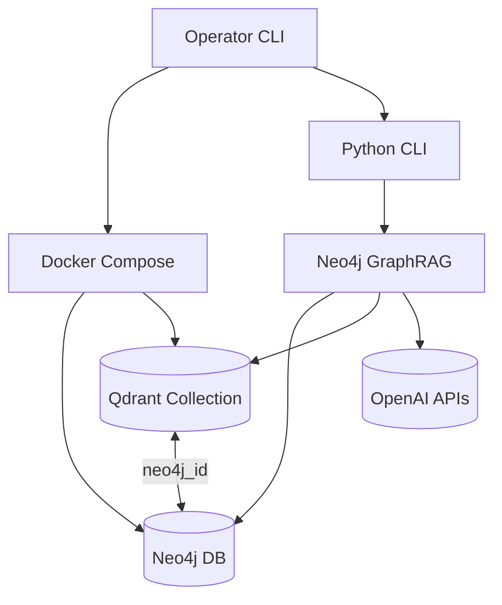

# Architecture Overview

## Technical Summary
The Neo4j GraphRAG solution runs as a Python 3.12 CLI that orchestrates knowledge graph ingestion, vector synchronization, and retrieval via the official `neo4j-graphrag` library. Version 1 anchors on a project-owned stack: Docker Compose launches Neo4j 5.26.12 (with APOC Core) and Qdrant 1.15.4 on the developer host, while Python scripts create the Neo4j vector index, execute `SimpleKGPipeline`, export embeddings to Qdrant, and query through `GraphRAG` with `QdrantNeo4jRetriever`. See the [Version Matrix](../README.md#version-matrix) for the canonical list of pinned components.

## High-Level Components
- Docker Compose stack (`docker-compose.neo4j-qdrant.yml`) that provisions Neo4j and Qdrant with persistent volumes and configurable credentials.
- CLI orchestrator housing subcommands for ingest, vectors, and search operations plus standalone scripts under `scripts/` (`create_vector_index.py`, `kg_build.py`, `export_to_qdrant.py`, `ask_qdrant.py`).
- Knowledge Graph Builder leveraging `SimpleKGPipeline` to populate Neo4j with Document and Chunk nodes and embeddings.
- Vector export service that streams embeddings from Neo4j into Qdrant with join payloads.
- Retrieval engine that joins Qdrant hits with Neo4j entities and delegates answer generation to OpenAI models.
- Workspace bootstrap script (`scripts/bootstrap.sh`) that provisions the Python 3.12 virtual environment, installs `neo4j-graphrag[experimental,openai,qdrant]`, and validates imports. Run it before executing Compose workflows and activate the virtualenv (`source .venv/bin/activate`) prior to running scripts.

## Built-In Tool Playbook
Always consult the canonical documentation set below before running any GraphRAG tooling (CLI subcommands, bootstrap scripts, or diagnostics helpers). These files are updated whenever workflows change and must be treated as the source of truth:

- `docs/architecture/overview.md` (this file) — top-level workflows, environment sequencing, and operational guardrails.
- `docs/architecture/source-tree.md` — current locations for CLI entrypoints, pipelines, and support modules.
- `docs/architecture/coding-standards.md` — logging, retry, and testing expectations that every command must uphold.
- `PYTHONPATH=src python3 -m scripts.check_docs --strict` — documentation lint guard that enforces minimal-path instructions and native retriever references remain accurate before shipping ingestion or retrieval updates. Results are written to `artifacts/docs/check_docs.json` and failures surface actionable remediation hints.
- `PYTHONPATH=src python3 scripts/kg_build.py --enable-semantic` — optional semantic enrichment pass that invokes the GraphRAG `LLMEntityRelationExtractor`, writes entity/relationship nodes tagged with `semantic_source=kg_build.semantic_enrichment.v1`, and records additional QA metrics governed by `--qa-max-semantic-failures` and `--qa-max-semantic-orphans` thresholds. When either threshold is exceeded the run rolls back semantic nodes/relationships and exits with a non-zero status so base chunk ingestion remains intact.

- **Refactor Reference:** Before touching `scripts/kg_build.py`, review the refactor planning set — [project brief](../prd/projects/fancyrag-kg-build-refactor/project-brief.md), [architecture addendum](projects/fancyrag-kg-build-refactor.md), and [Epic 4](../bmad/focused-epics/kg-build-refactor/epic.md) — to confirm module boundaries, guardrails, and testing expectations.

Re-read the sections relevant to the command you intend to run and confirm the workflow still matches the latest documented steps. If a command deviates from the documented behaviour, halt and update the documentation before proceeding.

## Upcoming Refactor Alignment
- The `kg_build.py` monolith is slated for decomposition into `src/fancyrag/` modules (CLI, pipeline, QA, DB, config, utils).
- Keep this overview in sync with the addendum (`projects/fancyrag-kg-build-refactor.md`) as modules land; update the component list and diagrams when the package structure changes.
- Until the refactor merges, continue running the existing script but stage unit tests and CLI smoke coverage for parity.

## Diagram

## Change Log
| Date       | Version | Description                                         | Author    |
|------------|---------|-----------------------------------------------------|-----------|
| 2025-09-24 | 0.1     | Seeded architecture overview shard                  | Codex CLI |
| 2025-09-25 | 0.2     | Documented environment configuration workflow       | James     |
| 2025-09-25 | 0.3     | Added workspace diagnostics guidance                | James     |
| 2025-09-25 | 0.4     | Documented OpenAI readiness probe workflow          | James     |
| 2025-09-28 | 0.5     | Added Docker Compose stack and minimal path scripts | Codex CLI |
| 2025-10-02 | 0.6     | Documented semantic enrichment flag and QA thresholds | James     |
| 2025-10-02 | 0.7     | Added refactor alignment pointers and planning references        | Codex CLI |
| 2025-10-04 | 0.8     | Documented OpenAI base URL override and sanitisation guardrails | James     |

## Environment Configuration
- Copy `.env.example` to `.env` immediately after running `scripts/bootstrap.sh`. Populate values for `OPENAI_API_KEY`, `OPENAI_MODEL` (baseline `gpt-5-mini` with optional fallback `gpt-4o-mini`), `OPENAI_EMBEDDING_MODEL` (`text-embedding-3-small`), and local stack defaults (`NEO4J_URI=bolt://localhost:7687`, `NEO4J_USERNAME=neo4j`, `NEO4J_PASSWORD=neo4j`, `QDRANT_URL=http://localhost:6333`). `QDRANT_API_KEY` may remain blank for local usage.
- The CLI automatically loads variables from `.env` at repository root; override the location by setting `FANCYRAG_DOTENV_PATH` when invoking automation from alternate directories.
- Optional guardrails: `OPENAI_MAX_ATTEMPTS` (default 3) controls retry ceilings, `OPENAI_BACKOFF_SECONDS` adjusts the initial exponential backoff, and `OPENAI_ENABLE_FALLBACK` toggles whether operators may use the documented fallback chat model. Leave unset to accept defaults.
- To route traffic through a gateway/self-hosted deployment, set `OPENAI_BASE_URL` to an `https://` endpoint. Local-only `http://` testing requires explicitly setting `OPENAI_ALLOW_INSECURE_BASE_URL=true`; production deployments must remain TLS-only. The shared client and sanitizer mask the custom host in logs/telemetry automatically.
- Create data directories (`mkdir -p ./.data/neo4j/{data,logs,import} ./.data/qdrant/storage`) before starting the stack to ensure Docker bind-mounts use project-scoped storage.
- Validate configuration with `docker compose -f docker-compose.neo4j-qdrant.yml config` (or `scripts/check_local_stack.sh --config`) to confirm environment substitution before launching services.
- Start the stack with `scripts/check_local_stack.sh --up` (equivalent to `docker compose -f docker-compose.neo4j-qdrant.yml up -d`); stop it with `scripts/check_local_stack.sh --down` (adds `--volumes` when you want a clean reset).
- Keep `.env` git-ignored; never commit real credentials or paste secrets into shared channels.
- To target managed services, override the same variables without modifying script code.

## Workspace Verification
- After bootstrapping and populating `.env`, validate the environment with `PYTHONPATH=src python3 -m cli.diagnostics workspace --write-report` (or add `--verify` when running `scripts/bootstrap.sh`).
- The diagnostics command imports `neo4j_graphrag`, `neo4j`, `qdrant_client`, `openai`, `structlog`, and `pytest`, failing fast when dependencies are missing or misconfigured.
- A structured report is written to `artifacts/environment/versions.json` capturing Python runtime, package versions (via `importlib.metadata`), the SHA-256 of `requirements.lock`, and the current git commit for audit trails.
- Output is redacted automatically—no environment variables or secrets are persisted—allowing the report to be shared with operators and CI systems.
- Rerun diagnostics whenever dependencies change (`pip install`/`pip-compile` updates), before pushing Compose updates, or prior to releasing automation changes so drift is detected early.

## OpenAI Readiness Probe
- Run `PYTHONPATH=src python3 -m cli.diagnostics openai-probe` after the workspace diagnostics pass to validate OpenAI chat and embedding integrations end-to-end. The probe now routes through `cli.openai_client.SharedOpenAIClient`, ensuring every script shares the same guardrails, retries, and telemetry primitives.
- The probe issues a lightweight chat completion and embedding request using the configured defaults from `OpenAISettings`, writes a sanitized report to `artifacts/openai/probe.json`, and exports Prometheus metrics to `artifacts/openai/metrics.prom` with latency buckets spanning 100 ms–5 s.
- Guardrails include exponential backoff for 429/`RateLimitError` responses with token-budget remediation messaging, reusable sanitization helpers shared with other diagnostics, and structured telemetry that records fallback usage (`gpt-4o-mini`) without leaking prompts, API keys, or custom `OPENAI_BASE_URL` hostnames. Golden fixtures protect report/metrics schemas when updating the shared client.

## Minimal Path Workflow
1. Bootstrap workspace + `.env` (`scripts/bootstrap.sh`, then copy `.env.example`).
2. Validate compose configuration: `scripts/check_local_stack.sh --config` (wraps `docker compose config`).
3. Start containers: `scripts/check_local_stack.sh --up` (or run `docker compose -f docker-compose.neo4j-qdrant.yml up -d` directly).
4. Wait for health checks to pass (`scripts/check_local_stack.sh --status` polls container health).
5. Create the vector index (idempotent): `PYTHONPATH=src python3 scripts/create_vector_index.py --index-name chunks_vec --label Chunk --embedding-property embedding --dimensions 1024 --similarity cosine` (match `EMBEDDING_DIMENSIONS` for your embedding model).
6. Build the minimal knowledge graph: `PYTHONPATH=src python3 scripts/kg_build.py --source docs/samples/pilot.txt --chunk-size 600 --chunk-overlap 100`.
   - For larger corpora, choose a chunking profile (e.g., `--profile markdown` or `--profile code`) and optionally point at a directory: `PYTHONPATH=src python3 scripts/kg_build.py --source-dir docs --profile markdown --include-pattern "**/*.md"`. Profiles auto-tune chunk size/overlap and ensure deterministic ordering.
   - Turn on semantic enrichment when you need entity and relationship extraction: append `--enable-semantic` (tune concurrency with `--semantic-max-concurrency`). Semantic runs tag new nodes and relationships with `semantic_source=kg_build.semantic_enrichment.v1` and add QA coverage controlled by `--qa-max-semantic-failures` and `--qa-max-semantic-orphans`. If the QA thresholds trip, the workflow removes only the semantic entities/relationships for that run and exits non-zero; the base Document/Chunk graph remains untouched.
   - Directory ingestion skips non-text/binary files, logs warnings, and records per-chunk metadata (relative path, git commit, SHA-256 checksum, chunk indices) so downstream retrieval can filter by provenance.
   - Every ingestion run executes a QA gate before finalizing Neo4j writes and emits a versioned report (`ingestion-qa-report/v1`) under `artifacts/ingestion/<timestamp>/` (`quality_report.json` + `quality_report.md`). The report captures chunk/token histograms, orphan integrity, and checksum validation results. Override thresholds with `--qa-max-missing-embeddings`, `--qa-max-orphan-chunks`, and `--qa-max-checksum-mismatches`; failing gates roll back newly created chunks/documents and return a non-zero exit code.
   - Run logs capture both ingestion duration and `qa.qa_evaluation_ms`, and reports are scrubbed via the shared sanitizer to avoid leaking secrets or absolute filesystem paths.
7. Export embeddings: `PYTHONPATH=src python3 scripts/export_to_qdrant.py --collection chunks_main`.
8. Smoke retrieval: `PYTHONPATH=src python3 scripts/ask_qdrant.py --question "What did Acme launch?" --top-k 5`.
   - The CLI now delegates vector search + context joins to `neo4j_graphrag.retrievers.QdrantNeo4jRetriever`, wiring the Qdrant payload `chunk_id` to Neo4j `Chunk` nodes and returning the same sanitized log payload used by QA telemetry. Override the collection name or join properties via existing CLI/env settings if your deployment stores alternative identifiers.
9. Documentation lint guard: `PYTHONPATH=src python3 -m scripts.check_docs` verifies `docs/architecture/overview.md` and `docs/architecture/source-tree.md` still reflect the minimal-path workflow and native retriever usage.
10. Tear down containers when finished: `scripts/check_local_stack.sh --down --destroy-volumes` (adds `docker compose ... down --volumes` for a clean slate).

Both scripts load credentials from `.env`, reuse `SharedOpenAIClient` for retries/telemetry, and emit sanitized JSON logs under `artifacts/local_stack/` for smoke assertions. Adjust options as needed for managed deployments (e.g., `--database`, alternative chunk sizes).

All scripts honour `.env` overrides for connection details and exit non-zero on errors. Review `docs/architecture/coding-standards.md` before changing default retry or logging behaviour.

## Local Stack Automation
- `scripts/check_local_stack.sh` wraps common compose lifecycle commands (`--config`, `--up`, `--status`, `--down`). It emits structured logs and ensures health checks pass before succeeding.
- `scripts/check_docs.py` runs as part of release automation to guard against documentation drift; execute with `PYTHONPATH=src python3 -m scripts.check_docs`. The command exits non-zero on missing minimal-path instructions or retriever references and produces a sanitized report at `artifacts/docs/check_docs.json` for QA evidence.
- `tests/integration/local_stack/test_minimal_path_smoke.py` orchestrates the full minimal path once Docker and required API keys are available. Directory fixtures sample both documentation and code profiles for regression coverage.
- GitHub Actions workflow `local-stack-smoke.yml` enforces `docker compose config` linting and executes the smoke suite on pushes/PRs (requires Docker on runners).
- QA artifacts produced by `scripts/kg_build.py` are stored under `artifacts/ingestion/<timestamp>/`. CI jobs collect these reports (JSON + Markdown) to surface gating failures, semantic enrichment anomalies, and provide operators with sanitized summaries alongside runtime metrics.
