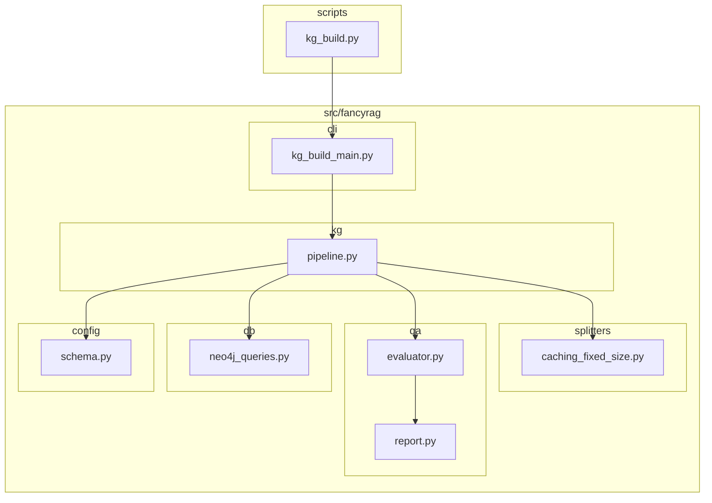

# Architecture: FancyRAG `kg_build.py` Monolith Decomposition and Repository Restructuring

## 1. Introduction

This document outlines the architecture for the refactoring of the FancyRAG codebase. The primary goal of this refactoring is to decompose the monolithic `scripts/kg_build.py` script into smaller, more manageable modules, and to restructure the repository to improve maintainability, testability, and scalability.

## 2. High-Level Design

The new architecture will follow a layered approach, with a clear separation of concerns between the command-line interface (CLI), the core business logic, and the data access layer.

### New Directory Structure

```text
fancyrag/
├── scripts/
│   └── kg_build.py
└── src/
    └── fancyrag/
        ├── __init__.py
        ├── cli/
        │   ├── __init__.py
        │   └── kg_build_main.py
        ├── config/
        │   ├── __init__.py
        │   └── schema.py
        ├── db/
        │   ├── __init__.py
        │   └── neo4j_queries.py
        ├── kg/
        │   ├── __init__.py
        │   └── pipeline.py
        ├── qa/
        │   ├── __init__.py
        │   ├── evaluator.py
        │   └── report.py
        ├── splitters/
        │   ├── __init__.py
        │   └── caching_fixed_size.py
        └── utils/
            ├── __init__.py
            └── env.py
```

### Component Diagram



## 3. Module-Level Design

- **`scripts/kg_build.py`**: Thin wrapper that calls the `main` function in `src/fancyrag/cli/kg_build_main.py`; contains no business logic.
- **`src/fancyrag/cli/kg_build_main.py`**: Handles CLI argument parsing and orchestrates execution of the KG build pipeline by instantiating classes from other modules.
- **`src/fancyrag/kg/pipeline.py`**: Orchestrates the KG build stages (data loading, splitting, semantic enrichment, QA, Neo4j interactions) and now exposes a typed `PipelineOptions` + `run_pipeline()` API consumed by the CLI and future automation.
- **`src/fancyrag/splitters/caching_fixed_size.py`**: Implements the `CachingFixedSizeSplitter` plus typed configuration and factory helpers for chunk size/overlap reuse.
- **`src/fancyrag/qa/evaluator.py`**: Contains the `IngestionQaEvaluator` class handling thresholds, totals math, and overall QA evaluation workflow.
- **`src/fancyrag/qa/report.py`**: Generates JSON and Markdown QA reports.
- **`src/fancyrag/db/neo4j_queries.py`**: Stores Cypher query strings and thin wrappers for counts and lookups against Neo4j.
- **`src/fancyrag/config/schema.py`**: Loads and validates KG schema definitions.
- **`src/fancyrag/utils/env.py`**: Centralizes environment variable utilities reused across modules.

## 4. Data Flow

1. User executes `scripts/kg_build.py` from the command line.
2. The script calls the `main` function in `src/fancyrag/cli/kg_build_main.py`.
3. `kg_build_main.py` parses arguments and instantiates the pipeline orchestrator.
4. `pipeline.py` performs the KG build by:
   - Loading the schema via `schema.py`.
   - Loading data for ingestion.
   - Splitting text with `caching_fixed_size.py`.
   - Interacting with Neo4j through `neo4j_queries.py`.
   - Evaluating ingestion quality using `evaluator.py`.
   - Producing QA reports with `report.py`.

## 5. Testing Strategy

- **Unit Tests:** Each new module includes unit tests to validate its behavior in isolation.
- **Integration Tests:** Cover interactions between modules, especially pipeline coordination with Neo4j and QA components.
- **End-to-End Tests:** A CLI smoke test runs the full KG build flow to confirm the refactored structure works end-to-end.

## 6. Deployment Strategy

- Perform refactoring on a dedicated feature branch.
- Run existing end-to-end tests to verify no regressions.
- Merge into the main branch once all tests pass and documentation is updated.
